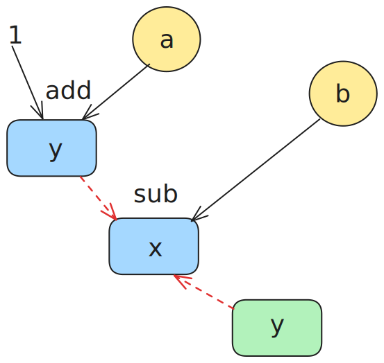
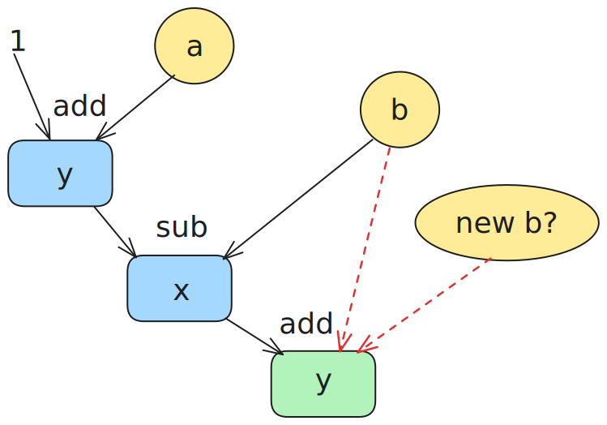
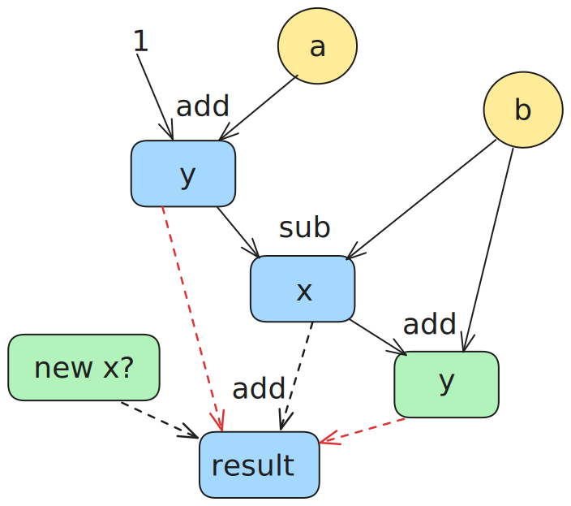

# 附录

## 从四元数到静态单赋值形式

**提示**：你可以跳过阅读这一部分，但是阅读该部分可能有助于你理解本实验中间代码的设计.

常见的平台无关中间代码是线性的一串指令.
在早期，指令的设计风格通常是四元数 (quads) 形式，例如 `x = y binop z`.
其中有操作码 `binop`，两个源变量 `y` 和 `z`，以及一个目标变量 `x`，因此被称为“四元数”.
一种常见的实现方式如下：

```cpp
class Instruction {
    // all possible opcode.
    enum Opcode { ... };
    Opcode op;
    // id of destination variable.
    int dst;
    // id of first and second source variable.
    int src0, src1;

    // instructions connected as a linked list.
    Instruction *next;
}
```

四元数看似很简单，但是有一个比较严重的问题，就是不太方便做代码优化，请看下面这条例子：

```plaintext
y = a add 1
x = y sub b
y = x add b
...

result = x add y
```

代码的优化经常需要追踪数据流，也就是追踪四元组中两个源变量的值是由哪条指令进行的赋值，又被哪些指令使用.
我们一步一步看.
首先是 `y = a add 1` 这条指令，似乎很显然，不是吗？
源变量 `a` 和常数 `1`.

但是遇到 `x = y sub b` 时，我们很快遇到了麻烦: 这条指令需要的 `y` 的值是哪里被赋值的，或者说 `y` 最新的值在哪里，是 `y = a add 1` 还是 `y = x add b`？



接下来的 `y = x add b`，源变量 `b` 还是上一条指令 `x = y sub b` 中用到的那个 `b` 吗？还是有其他指令为 b 赋了新值？



某一条和它们隔得很远的指令 `result = x add y`，它们的 `x` 和 `y` 又从哪里来？



你会发现，我们一直需要知道某个源变量最新的赋值发生在哪里，这意味这：

- 要么每次从后往前扫描，第一个遇到的对源变量的赋值，就是最新的值，这样时间开销很大.
- 要么维护一个稠密的集合，记录当前指令前所有变量最新的赋值发生在哪里，这样在变量很多的情况下空间开销很大.

上述这种关系被称为 use-def chain，静态单赋值形式 (SSA) 的优点之一就在于它能较好地维护 use-def chain.SSA 的一个特点是每个变量仅赋值一次，因此，上面的代码需要写成:

```plaintext
y.0 = a.0 add 1
x.0 = y.0 sub b.0
y.1 = x.0 add b.0
...

result.1 = x.0 add y.1
```

- 由于只赋值一次，每个赋值的变量名都是独一无二的，因此你可以把赋值看作“定义” (define) 了一个新变量，这样我们就能明确地知道源操作数的值是怎么产生的.
- 更进一步地，由于变量只赋值一次，我们不需要记录原变量的 id 或者 name，源变量的使用 (use) 只需要一个指向定义这个变量的指令的指针就可以表示.
- 再进一步，既然原变量使用指针索引，那么指令里面目标变量也失去了意义，指令本身就可以指代“变量”本身.

经过这么一番改造，指令的实现大致如下所示：

```cpp
class Instruction {
    // all possible opcode.
    enum Opcode { ... };
    Opcode op;

    // first and second source variable.
    // `use` of the `definition` of src0 and src1.
    Instruction *src0, *src1;

    // instructions connected as a linked list.
    Instruction *next;
}
```

如果你有兴趣，可以阅读 Cliff Click 的 [From Quads to Graphs](http://softlib.rice.edu/pub/CRPC-TRs/reports/CRPC-TR93366-S.pdf)，以及 [SSA Book](https://link.springer.com/book/10.1007/978-3-030-80515-9)。 
