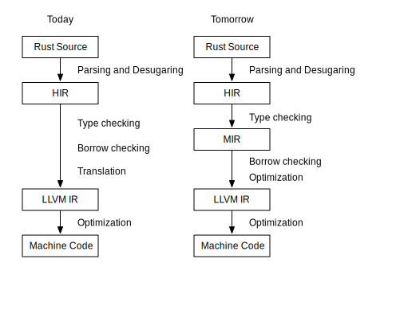

# Lab 3：中间代码生成


## 背景知识

正如课上可能提到过的，如果没有中间表示 (Intermediate Representation，简称 IR)，n 门语言 m 种硬件平台各自写编译器，就可能需要 n * m 种编译器，但是 n 门语言的前端编译到一个统一的 IR 然后再由 IR 编译到不同的后端，这样只需要 n + m 个“编译器”.

但是，IR 的作用并不仅限于减少编译器开发的工作量，在现代编译器架构下，具体体现在 IR 所指代的对象宽泛化了，现在 IR 通常可以用于泛指“源代码”与“目标平台汇编”之间的各种表示形式，例如抽象语法树、目标无关的中间代码、三地址码风格的类机器代码层等：

- 抽象语法树 AST，树形结构，贴近源代码层，适合做语法糖的展开、构建符号表、类型检查等靠近编程语言的高层级抽象的任务。
同时，也更容易利用这些信息做一些高层次的优化，换句话说他们和程序语言的设计风格息息相关.
例如在 AST 层级，通常是结构化控制流（例如 while loop, for loop, if, switch，函数式风格的可能有 parallel, reduce, yield 等），模式匹配 (pattern match) 就可以被展开为一棵高效的决策树 (decison tree)，减少多余的比较和跳转.
- 目标无关的中间代码（**我们在这里**），常见的设计是线性指令. 由于是平台无关的，设计上通常会考虑屏蔽底层细节；由于考虑适配多语言前端的需要，抛弃了多数高层级信息，更为贴合底层汇编.
在这一层级，一般则为非结构化控制流（例如无条件跳转 jump，分支跳转 branch 等），一般进行例如常量传播、公共子表达式折叠、不变式归纳等与硬件细节无关的优化.
以及控制流分析、数据流分析、别名分析等普适的分析.
- 三地址码风格的类机器代码层，形式上非常接近汇编，甚至可以直接按照汇编指令的格式设计.
这一层非常靠近硬件，优化需要考虑不同指令的延迟、吞吐量、流水线、ABI 等，许多问题是 NP-Hard 的.

我们可以看到，实际上每一层“中间表示”都有各自的特点，依次从高抽象走向低级，适合做的任务也不同，每一层都是一个小型的“编译系统”，因此现代编译器通常会采用多层 IR.

例如 Rust 就曾经在前端增加了一层 [MIR](https://blog.rust-lang.org/2016/04/19/MIR.html)，borrow checker 就在 MIR 层上进行分析：




## 中间代码的定义

本实验的 IR 是类似 LLVM IR 的 partial SSA 形式，具体的规范请参阅 [Accipit IR 规范](accipit-spec.md).

下面这段阶乘的样例代码能帮助你实现一个功能正确（虽然显然欠优化的）的中端代码.

源码：

```c
int factorial(int n) {
    if (n == 1) {
        return 1;
    } else {
        int ans = n * factorial(n - 1);
        return ans;
    }
}
```

参考中间代码：
```rust

fn %factorial(#n: i64) -> i64 {
%Lentry:
    // create a stack slot of i64 type as the space of the return value.
    // if n equals 1, store `1` to this address, i.e. `return 1`,
    // otherwise, do recursive call, i.e. return n * factorial(n - 1).
    let %ret.addr: i64* = alloca i64, 1
    // store function parameter on the stack.
    let %n.addr: i64* = alloca i64, 1
    let %4: () = store #n, %n.addr
    // create a slot for local variable ans, uninitialized.
    let %ans.addr: i64* = alloca i64, 1
    // when we need #n, you just read it from %n.addr.
    let %6: i64 = load %n.addr
    // comparison produce an `i8` value.
    let %cmp: i1 = eq %6, 0
    br i1 %cmp, label %Ltrue, label %Lfalse
%Ltrue:
    // retuen value = 1.
    let %10: () = store 1, %ret.addr
    jmp label %Lret
%Lfalse:
    // n - 1
    let %13: i64 = load %n.addr
    let %14: i64 = sub %13, 1
    // factorial(n - 1)
    let %res: i64 = call fn %factorial, %14
    // n
    let %16 = load %n.addr
    // n * factorial(n - 1)
    let %17: i64 = mul %16, %res
    // write local variable `ans`
    let %18: () = store %17, %ans.addr
    // now we meets `return ans`, which means we
    // should first read value from `%ans.addr` and then
    // write it to `%ret.addr`.
    let %19: i64 = load %ans.addr
    let %20: () = store %19, %ret.addr
    jmp label %Lret
%Lret:
    // load return value from %ret.addr
    let %ret.val: i64 = load %ret.addr: i64*
    ret %ret.val: i64
}
```

### 基本块的处理

基本块是划分控制流的边界，基本块内指令有序地线性执行，控制流跳转只存在于基本块之间，这种关系使得基本块之间连成一个有向图，一般称为控制流图 (Contorl Flow Graph，简称 CFG).
例如：`if` 的两个分支分别翻译到两个基本块 `Ltrue` 与 `Lfalse`.


上图是使用 llvm 组件生成的可视化控制流图，你可以使用以下命令获得：

```bash
# clang emit llvm bytecode
$ clang -S -emit-llvm file.c -o file.bc
# convert to dot file
$ opt -dot-cfg -disable-output -enable-new-pm=0 file.bc
Writing '.file.dot'...
# dot render png file
$ dot -Tpng -o test.png .test.dot
```

在 `if` 分支入口前，有一个基本块作为入口，计算 `if` 条件的真假，即 `%cmp`； 
在 `if` 的两个分支结束后，控制流进行了“合并”，处理下一个语句块，进行一个无条件跳转 `br label %ret`，来到了出口基本块 `%ret`.
这是结构化控制流通常的处理方式，你可以将其类推到 `while` 循环，下面是一个示意图：


### 局部变量的处理

最简单的实现方式是为所有局部作用域的变量都开辟一块栈上的空间，读局部变量就是 load 对应的地址（IR 中即为 alloca 获取的指针类型的值），写局部变量就是把结果 store 入对应的地址.

如果你还不明白，请看下面的示意图：


## 从四元数到静态单赋值形式

**提示**：你可以跳过阅读这一部分，但是阅读该部分可能有助于你理解本实验中间代码的设计.

常见的平台无关中间代码是线性的一串指令.
在早期，指令的设计风格通常是四元数 (quads) 形式，例如 `x = y binop z`.
其中有操作码 `binop`，两个源变量 `y` 和 `z`，以及一个目标变量 `x`，因此被称为“四元数”.
一种常见的实现方式如下：

```c
class Instruction {
    // all possible opcode.
    enum Opcode { ... };
    Opcode op;
    // id of destination variable.
    int dst;
    // id of first and second source variable.
    int src0, src1;

    // instructions connected as a linked list.
    Instruction *next;
}
```

四元数看似很简单，但是有一个比较严重的问题，就是不太方便做代码优化，请看下面这条例子：

```plaintext
y = a add 1
x = y sub b
y = x add b
...

result = x add y
```

代码的优化经常需要追踪数据流，也就是追踪四元组中两个源变量的值是由哪条指令进行的赋值，又被哪些指令使用.
我们一步一步看.
首先是 `y = a add 1` 这条指令，似乎很显然，不是吗？
源变量 `a` 和常数 `1`.

但是遇到 `x = y sub b` 时，我们很快遇到了麻烦: 这条指令需要的 `y` 的值是哪里被赋值的，或者说 `y` 最新的值在哪里，是 `y = a add 1` 还是 `y = x add b`？


接下来的 `y = x add b`，源变量 `b` 还是上一条指令 `x = y sub b` 中用到的那个 `b` 吗？还是有其他指令为 b 赋了新值？


某一条和它们隔得很远的指令 `result = x add y`，它们的 `x` 和 `y` 又从哪里来？


你会发现，我们一直需要知道某个源变量最新的赋值发生在哪里，这意味这：
- 要么每次从后往前扫描，第一个遇到的对源变量的赋值，就是最新的值，这样时间开销很大.
- 要么维护一个稠密的集合，记录当前指令前所有变量最新的赋值发生在哪里，这样在变量很多的情况下空间开销很大.

上述这种关系被称为 use-def chain，静态单赋值形式 (SSA) 的优点之一就在于它能较好地维护 use-def chain.SSA 的一个特点是每个变量仅赋值一次，因此，上面的代码需要写成:

```plaintext
y.0 = a.0 add 1
x.0 = y.0 sub b.0
y.1 = x.0 add b.0
...

result.1 = x.0 add y.1
```

- 由于只赋值一次，每个赋值的变量名都是独一无二的，因此你可以把赋值看作“定义” (define) 了一个新变量，这样我们就能明确地知道源操作数的值是怎么产生的.
- 更进一步地，由于变量只赋值一次，我们不需要记录原变量的 id 或者 name，源变量的使用 (use) 只需要一个指向定义这个变量的指令的指针就可以表示.
- 再进一步，既然原变量使用指针索引，那么指令里面目标变量也失去了意义，指令本身就可以指代“变量”本身.

经过这么一番改造，指令的实现大致如下所示：

```c
class Instruction {
    // all possible opcode.
    enum Opcode { ... };
    Opcode op;

    // first and second source variable.
    // `use` of the `definition` of src0 and src1.
    Instruction *src0, *src1;

    // instructions connected as a linked list.
    Instruction *next;
}
```

如果你有兴趣，可以阅读 Cliff Click 的 [From Quads to Graphs](http://softlib.rice.edu/pub/CRPC-TRs/reports/CRPC-TR93366-S.pdf).

## 你的任务

在实现 lexer 和 parser 的基础上，将语法树转换为中间代码