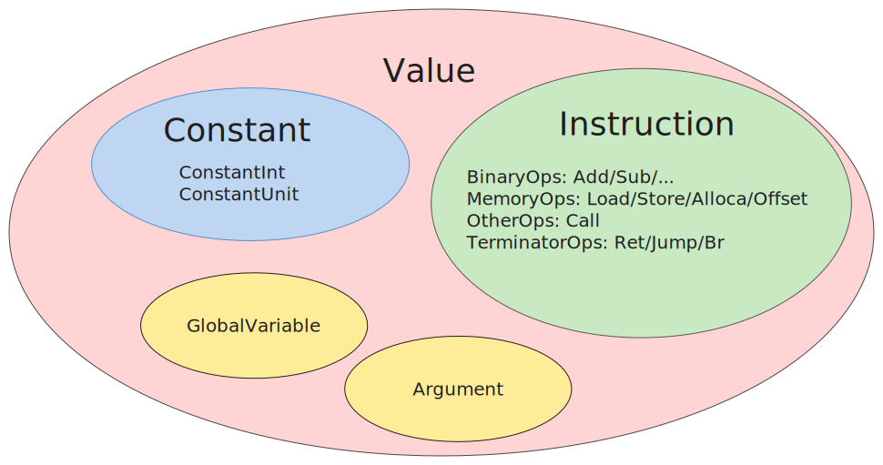

# Lab 3：中间代码生成


## 背景知识

正如课上可能提到过的，如果没有中间表示 (Intermediate Representation，简称 IR)，n 门语言 m 种硬件平台各自写编译器，就可能需要 n * m 种编译器，但是 n 门语言的前端编译到一个统一的 IR 然后再由 IR 编译到不同的后端，这样只需要 n + m 个“编译器”.

但是，IR 的作用并不仅限于减少编译器开发的工作量，在现代编译器架构下，具体体现在 IR 所指代的对象宽泛化了，现在 IR 通常可以用于泛指“源代码”与“目标平台汇编”之间的各种表示形式，例如抽象语法树、目标无关的中间代码、三地址码风格的类机器代码层等，从中间代码所在的抽象层次来看：

- **抽象语法树 AST（高层 IR）**：树形结构，贴近源代码层，适合做语法糖的展开、构建符号表、类型检查等靠近编程语言的高层级抽象的任务.
它们和程序语言的设计风格息息相关，因此能够做一些更抽象、更高级的优化.
例如，AST 层级仍然保留结构化控制流（例如 while loop, for loop, if, switch，函数式风格的可能有 parallel, reduce, yield 等）信息，模式匹配 (pattern match) 就可以被展开为一棵高效的决策树 (decison tree)，减少多余的比较和跳转.
- **目标无关的中间代码（中层 IR）**：本实验讨论的部分. 常见的设计是线性指令.
由于是平台无关的，设计上通常会考虑屏蔽底层细节；由于考虑适配多语言前端的需要，抛弃了多数高层级信息，更为贴合底层汇编.
例如 LLVM IR 在形式上就非常类似 RISC 汇编，但是仍然有 GEP 这样的高级指令.
在这一层级，通常只剩下了非结构化控制流（例如无条件跳转 jump，分支跳转 branch 等），进行例如常量传播、公共子表达式折叠、不变式归纳等与硬件细节无关的优化，以及控制流分析、数据流分析、别名分析等普适的分析.
- **三地址码或四元组风格的类机器代码层（低层 IR）**，形式上非常接近汇编，甚至可以直接按照汇编指令的格式设计.
这一层非常靠近硬件，优化需要考虑不同指令的延迟、吞吐量、流水线、ABI 等，许多问题是 NP-Hard 的.

我们可以看到，实际上每一层“中间表示”都有各自的特点，依次从高抽象走向低级，适合做的任务也不同，每一层都是一个小型的“编译系统”，因此现代编译器通常会采用多层 IR.
此外，由于涉及的任务不同，IR 也有不同的结构结构特征：

- **树或者图结构**：使用图（graph）来表示程序的信息，用节点表示程序里的对象，用边表示关系，此类结构一般能详尽准确地描述程序内的各类信息. 抽象语法树（AST）是一种典型的树形 IR.
- **线型结构**：例如汇编语言中指令之间就是线型关系。你可以将这种中间代码看成是某种抽象计算机的一个简单的指令集。
- **混合型**：混合了图和线性两种中间代码风格，例如本实验所使用的 Accipit IR. Accipit IR 将代码组织成许多基本块，块内部采用线型表示，块与块之间采用图表示.

Rust 就曾经在前端增加了一层图结构 [MIR](https://blog.rust-lang.org/2016/04/19/MIR.html)，borrow checker 就在 MIR 层上进行分析：


当然，并不是说抽象层级越高，相应地结构特征就会越复杂.
例如，C 语言的源码是线型的字符串，语句与语句之间也线型的；WASM 汇编可以使用类似树形的 SExpr 格式嵌套表示.

```wasm title="add.wast"
(func (export "add") (param $x i32) (param $y i32)
    (result i32) 
    (i32.add 
        (local.get $x)
        (local.get $y)
    )
)
```


## 中间代码的定义

本实验的 IR 是类似 LLVM IR 的 partial SSA 形式，即利用 `alloca` `load` `store` 三条指令在 SSA 形式上“开洞”，具体的规范请参阅 [Accipit IR 规范](appendix/accipit-spec.md).
我们在附录还提供了一些样例：[SysY 结构与 Accipit IR 的对应](appendix/sysy-accipit-mapping.md)，为你演示如何从 SysY 前端的高层级结构翻译到 Accipit IR。

下面这段阶乘的样例代码能帮助你实现一个功能正确（虽然显然欠优化的）的中端代码.

源码：

```c
int factorial(int n) {
    if (n == 1) {
        return 1;
    } else {
        int ans = n * factorial(n - 1);
        return ans;
    }
}
```

参考中间代码：
```rust
fn @factorial(#n: i32) -> i32 {
%Lentry:
    // create a stack slot of i32 type as the space of the return value.
    // if n equals 1, store `1` to this address, i.e. `return 1`,
    // otherwise, do recursive call, i.e. return n * factorial(n - 1).
    let %ret.addr = alloca i32, 1
    // store function parameter on the stack.
    let %n.addr = alloca i32, 1
    let %4 = store #n, %n.addr
    // create a slot for local variable ans, uninitialized.
    let %ans.addr = alloca i32, 1
    // when we need #n, you just read it from %n.addr.
    let %6 = load %n.addr
    // comparison produce an `i8` value.
    let %cmp = eq %6, 0
    br %cmp, label %Ltrue, label %Lfalse
%Ltrue:
    // retuen value = 1.
    let %10 = store 1, %ret.addr
    jmp label %Lret
%Lfalse:
    // n - 1
    let %13 = load %n.addr
    let %14 = sub %13, 1
    // factorial(n - 1)
    let %res = call @factorial, %14
    // n
    let %16 = load %n.addr
    // n * factorial(n - 1)
    let %17 = mul %16, %res
    // write local variable `ans`
    let %18 = store %17, %ans.addr
    // now we meets `return ans`, which means we
    // should first read value from `%ans.addr` and then
    // write it to `%ret.addr`.
    let %19 = load %ans.addr
    let %20 = store %19, %ret.addr
    jmp label %Lret
%Lret:
    // load return value from %ret.addr
    let %ret.val = load %ret.addr
    ret %ret.val
}
```

### 基本块的处理

基本块是划分控制流的边界，基本块内指令有序地线性执行，控制流跳转只存在于基本块之间，这种关系使得基本块之间连成一个有向图，一般称这个有向图为控制流图 (Contorl Flow Graph，简称 CFG).
例如：`if` 的两个分支分别翻译到两个基本块 `Ltrue` 与 `Lfalse`.


上图是使用 llvm 组件生成的可视化控制流图，你可以使用以下命令获得：

```bash
# clang emit llvm bytecode
$ clang -S -emit-llvm file.c -o file.bc
# convert to dot file
$ opt -dot-cfg -disable-output -enable-new-pm=0 file.bc
# if you are using a newer version of LLVM toolchain with new PassManager, try
# $ opt -passes=dot-cfg -disable-output test.bc
Writing '.file.dot'...
# dot render png file
$ dot -Tpng -o file.png .file.dot
```

在 `if` 分支入口前，有一个基本块作为入口，计算 `if` 条件的真假，即 `%cmp`； 
在 `if` 的两个分支结束后，控制流进行了“合并”，处理下一个语句块，进行一个无条件跳转 `br label %ret`，来到了出口基本块 `%ret`.
这是结构化控制流通常的处理思路，你可以将其类推到 `while` 循环，下面是一个示意图：


### 局部变量的处理

最简单的实现方式是为所有局部作用域的变量都开辟一块栈上的空间，读局部变量就是 load 对应的地址（IR 中即为 alloca 获取的指针类型的值），写局部变量就是把结果 store 入对应的地址.

如果你还不明白，请看下面的示意图并佐以[SysY 结构与 Accipit IR 的对应](appendix/sysy-accipit-mapping.md)：


## 语法制导代码生成

下一步我们就要把经过语义检查语法树转换成 Accipit 中间代码.
首先，简要回顾 Accipit IR 的结构，详细请看 [Accipit IR 规范](appendix/accipit-spec.md)：

- **Type（类型）**：包括基本类型 `i32` `()` 以及指针类型、函数类型.
- **Instruction（指令）**：指令分为 value binding 和 terminator 两类. 前者主要进行数据操作，有 `let` 开头，定义一个新变量；后者主要进行控制流操作，如无条件跳转和条件跳转等.
- **Value（值）**：值包含指令所定义的符号 `symbol` 和常量 `const` 两类.
- **BasicBlock（基本块）**：基本块包含若干线性排列的指令序列，其中最后一条指令必须是 terminator. 基本块内部的指令序列线性排列，线性执行（线性结构）；基本块之间的跳转构成图结构，表示控制流的跳转（图结构）.
- **Function（函数）**：函数的名称，类型等.
- **Module（模块）**：表示整个编译单元，包含函数和全局变量等.

以及再次重申这条重要原则：

!!! warning "注意"
    出于某种神秘的原因，我们规定每个变量只能在定义的时候被赋值一次. 也就是说，每条 value binding 类型的指令的定义的变量，在对应的作用域内要求是**唯一**的，至于为什么，你可以参考[附录：从四元组到静态单赋值形式](quads2ssa.md).
    所以，我们在语法上用 `let` 来暗示这一点.
    有一些相应的翻译技巧处理源代码出现多次赋值的情况，详细请看[附录：SysY 结构与 Accipit IR 的对应](sysy-accipit-mapping.md)

翻译的基本思路是遍历语法树的节点，然后根据节点的类型生成对应的中间代码.
整个翻译的最大矛盾在于前端树结构的语法树和后端线性的汇编之间的差异，本实验的核心哲学便在于中间代码如何连接这两种迥异的代码表示形式：

- **数据流（Data Flow）**：语法树只记录了变量的名字而且可能有重名变量，而汇编的只能操作有限的物理寄存器. 中间代码需要理清表达式所使用的变量的数据来源，从而能够最终映射到寄存器操作上. Accipit IR 规范中的 value 一定程度上表征了“数据”，即符号或常量.
- **控制流（Control Flow）**：语法树语句块是结构化的、嵌套的树形结构，并没有显式的控制流跳转；汇编是线型的，需要给不同的子语句块标记 label，并加上合适的跳转指令. 中间代码需要理清不同语句块之间的控制流跳转关系.

我们实现一个 translate_X 函数，X 对应表达式，语句等等.

- `translate_expr` 将表达式翻译到中端 IR 的 value. 起到跟踪数据流，完成表达式翻译到线性的指令的任务.
- `translate_stmt` 将语句块翻译到中端 IR 的 basicblock.
你需要跟踪控制流，将语句块之间的关系翻译到控制流跳转任务，插入合适的 terminator 指令.

### 表达式生成

在 Accipit IR 中，值 (value) 包括变量和常数.

我们先定义 `Value` 类型，并给出一些可供参考的实现方式：

!!! tip "实现建议"
    === "C"
        C 通常使用 enum + union：

        ```c
        enum value_kind {
            kind_constant_int32,
            Kind_constant_unit,
            // ...
            kind_binary_expression,
            kind_function_call,
            kind_load,
            kind_store,
            // ...
        };

        struct value {
            enum value_kind kind,
            struct type *ty;
            union {
                struct { int number; } constant_int32;
                struct { enum binary_op op, struct value *lhs, *rhs; } binary_expr;
                struct { struct function *callee, struct vector args } function_call;
                struct { struct value* src_addr } load;
                struct { struct value* dest_addr, struct value *value_to_be_stored } store;
            };
        };
        ```

        使用一个枚举类型 enum 来标记 Value 的类型，union 来存储不同 Value 的 field，这种方式我们一般称为 "tagged union".
        因此，在遍历 Value 时，需要根据 Value 的类型来做不同的操作：

        ```c
        void handle_value(struct value *val) {
            switch (val->kind) {
                case kind_constant_int32:
                    handle_constant_int32(val);
                    break;
                case kind_constant_unit:
                    handle_constant_unit(val);
                    break;
                case kind_binary_expression:
                    handle_binary_expression(val);
                    break;
                // ...
                case kind_store:
                    handle_store_expression(val);
                    break;
                default:
                    raise_error_and_dump();
            }
        }
        ```

    === "C++"
        C++ 可以使用 `std::variant` 来代替 C 的 enum + union 来实现 “类型安全” 的 tagged union，具体可以看 [cpp reference](https://en.cppreference.com/w/cpp/utility/variant)。
        简单来说，当一个 Value 实际上是 `kind_constant_int32` 类型，但是你错误地使用了处理 `kind_binary_expression` 类型的函数处理它，就会错误地把这个 Value 当作二元表达式来处理，因此得出错误的结果，然而不论是编译时还是运行时都不会对这样的误用产生任何的报错。
        而 `std::variant` 会在上述情况发生时扔出异常，方便你 debug。

        除了 C 风格，C++ 可以使用面对对象实现：

        ```cpp
        class Value {
            Type *ty;
            /*...*/ 
        };

        class ConstantInt : public Value {
            int number;
            /*...*/ 
        };

        class BinaryExpr: public Value {
            Value *lhs, *rhs;
            /*...*/
        };

        class FnCall: public Value {
            Function *callee;
            std::vector<Value *> args;
        };
        ```

        在这种实现模式下，在遍历 Value 时如何判断当前 Value 是哪种类型，以便我们用正确的函数处理不同类型的 Value 呢？
        有三大类方法：

        * 使用虚函数（不推荐）

            例如，我一个打印 IR 的函数叫做 `print_value`，给 Value 声明一个虚成员函数 `virtual void print_value()`，然后每个 Value 的子类继承时重载这个函数，这样我们就可以对所有 Value 类型的变量直接调用 `value->print_value()` 即可.
            但是缺点是，你永远不可能知道你到底需要多少这样的处理 Value 的函数，新增一个 `Value::foo()`，你就要回过头去修改所有 Value 以及子类的声明；再新增一个 `Value::bar()`，你还要重复上面的事情.
            这样很麻烦，而且也不优雅.
            因此虚函数只适合类似 print 必要的和功能固定的操作.

        * 使用 RTTI（可行，~~自己看着用.jpg~~）

            C++ 标准有一个特性 “运行时类型识别” (Runtime Type Identification, RTTI).
            使用运算符 `typeid` 会返回一个运行时的、对用户不透明的 `std::type_info` 类型，具体可参考 [cpp reference](https://en.cppreference.com/w/cpp/types/type_info).
            你可以获取 `type_info` 的内部名字以及通过 `==` 比较两个 `type_info` 是否相等，这里我们为大家编写了一个 [godbolt 在线样例](https://godbolt.org/z/o4W7To3Ya).
        
        * 使用模板黑魔法（推荐，写起来优雅，~~不得不品尝的环节出现了，大雾~~）

            这个方法不需要 C++ 的 RTTI，本质上仍然是 C 风格的 “enum + union”，但是更安全，只需要用到用到 C++ 11 的 `type_traits` 标准库和一点点模板魔法.

            首先，常见的做法是新建一个 `Common.def`，然后定义宏：

            ```cpp title="Common.def"
            #ifndef ValueKindDefine
            #define ValuKindDefine(x)
            #endif

            ValueKindDefine(SV_ConstantInt)
            ValueKindDefine(SV_ConstantUnit)
            ValueKindDefine(SV_BinaryExpr)
            ValueKindDefine(SV_Alloca)
            // ....
            ValueKindDefine(SV_Store)
            ValueKindDefine(SV_Load)

            // Gaurd
            #undef ValueKindDefine
            ```

            这个宏的作用是利用 include 的原理是直接文本插入来让编译器帮你完成 enum 的填写：

            ```cpp title="Value.h"
            #define ValueTypeDefine(x) x,
            enum ValueKind {
            #include "Common/Common.def"
            };
            ```

            这样我们就完成了类似 C 中 value_kind 的 enum 定义，然后在基类 Value 中添加 `value_kind` 字段，这个字段标识了这个 Value 具体是哪个类型，你还可以利用 C++ 11 的初始化静态成员语法来给所有 Value 的子类初始化 `value_kind` 字段：

            ```cpp title="Value.h"
            class Value {
            protected:
                /*...*/
                ValueKind value_kind;
            public:
                Value(ValueKind kind): value_kind(kind) {/* ... */}
            };

            class ConstantInt : public Value {
                constexpr static ValueKind this_kind = SV_ConstantInt;
                ConstantInt(): Value(value_kind) { /* ... */ }
                int number;
                /*...*/ 
            };

            class BinaryExpr: public Value {
                constexpr static ValueKind this_kind = SV_BinaryExpr;
                BinaryExpr(): Value(this_kind) { /* ... */ }
                Value *lhs, *rhs;
                /*...*/
            };
            ```

            ~~到这一步你回头还来得及~~，其实以上这些代码已经足够让你像 C 一样通过 `value_kind` 这个标记来区分不同的 Value 了：每个 Value 的子类的构造函数都会将自己这个类的标记 `this_kind` 赋给基类的 `value_kind`.
            但是，模板魔法能让他们更进一步，接下来是两个最最重要的模板：

            ```cpp title="Value.h"
            class Value {
            // ...
            public:
                template <typename T>
                bool is() {
                    return value_type == std::remove_pointer_t<T>::this_kind;
                }
                template <typename T>
                T as() {
                    if (is<T>()) {
                        return static_cast<T>(this);
                    } else {
                        return nullptr;
                    }
                }
            };

            Value *constant_int = new ConstantInt;
            // variable `constant_int` is NOT `BinaryExpr` type
            assert(!constant_int->is<BinaryExpr>())
            // variable `constant_int` is `ConstantInt` type
            assert(constant_int->is<ConstantInt>())

            if (ConstantInt *inner = constant_int->as<ConstantInt *>()) {
                assert(true, "Yes, `constant_int` is ConstantInt, \
                            so the branch is reachable");
            }
            
            if (BinaryExpr *inner = constant_int->as<BinaryExpr *>()) {
                assert(false, "No, `constant_int` is NOT BinaryExpr, \
                            so this branch is unreachable");
            }
            ```

            首先，对于 `is` 模板，`constant_int->is<BinaryExpr>()` 实际上在做：

            ```cpp
            constant_int->value_kind == BinaryExpr::this_kind;
            ```

            由于 `constant_int` 的 value_kind 是 `SV_ConstantInt` 因此返回 false.

            同理，对于 `as` 模板，`if (ConstantInt *inner = constant_int->as<ConstantInt *>()) { ... }` 实际上做的是：

            ```cpp
            // `std::remove_pointer_t<ConstantInt *>` gets `ConstantInt`
            if (constant_int->value_kind == ConstantInt::this_kind) {
                // safe cast, or ...
                return (ConstantInt *)(this);
            } else {
                // return nullptr as failure
                return nullptr;
            }
            ```

            也就是说，如果 `is` 检查通过了，就能安全地 cast 到对应的子类型，否则返回 nullptr.
            返回 nullptr 很大程度上方便了上面这种在 if 的条件里面定义变量的语法，如果是正确的类型，就会进入 if 的真分支；否则返回 nullptr 就不会进入 if 真分支.

            **注意**: `std::remove_pointer_t` 是必须的，因为我们通常会和 `Value *` 类型打交道，而不是 `Value` 本身.
            你会发现 `is` 使用的模板参数是 Value 的子类型本身，而 `as` 通常用的是 Value 子类型的指针.

            完成了上述基础设施之后，下面我们来看怎么处理不同的 Value 类型，考虑 print 操作：

            * 一是 C 风格的 switch 分发：

                ```cpp title="IRPrinter.cpp"
                void printValue(Value *V) {
                    switch (V->value_kind) {
                #define ValueTypeDefine(type) \
                    case x: print##type(V);   \
                            break;
                #include "Common.def"
                    default:
                        /* ... */
                    }
                }


                // Individual function for each value kind.
                void printSV_ConstantInt(Value *V) { /* ... */ }
                void printSV_BinaryExpr(Value *V) { /* ... */ }
                ```

            * 一是用上面的 "if + as" 结构：

                ```cpp title="IRPrinter.cpp"
                void printValue(Value *V) {
                    if (auto *C = V->as<ConstantInt *>()) {
                        C->foo();
                    }

                    if (auto *B = V->as<BinaryExpr *>()) {
                        B->bar();
                    }

                    /* ... */
                }
                ``` 

    === "OCaml"
        ML 系语言以及 Rust 都支持代数数据类型 (Algebraic Data Type)，可以很方便地定义：

        ```ocaml
        type ValueKinds = ConstantInt of int
            | ConstantUnit
            | BinaryExpr of BinOp * Value * Value
            | FunctionCall of Function * Value list
            | Load of Value
            | Store of Value * Value
        and
        type Value = Type * ValueKinds
        ```

        都直接 ADT 了，pattern match 吧...

然后我们定义 `translate_expr` 函数：

```plaintext
translate_expr(expr, symbol_table, current_bb) -> value
```

其中 `symbol_table` 是符号表，维护一个 `string -> value` 的映射，虽然在类似 SSA 的形式下，变量的名字并不重要，但是在处理局部变量时，我们要每个局部变量分配一个栈上的地址，为此我们需要记录变量名字到对应 alloca 指令的映射.
对于重复命名的变量，如在一个语句块里定义的变量和外层的变量重名时，请你自行处理.

由于 `translate_expr` 只是翻译表达式，没有任何控制流转移，因此只会生成线性的指令流，因此考虑传入基本块信息 `current_bb`，表示当前控制流在 `current_bb` 这个基本块，翻译得到的指令序列应当插入此处.

面对形如 `expr1 + expr2` 这样的二元表达式（下文记作 `expr0`），调用 `translate_expr(expr0, sym_table, current_bb)` 进行翻译.
我们递归调用两个子节点的 `translate_expr`，然后生成一条加法指令将他们加起来，最后 `result_value` 将作为最后的返回值：

```plaintext
lhs_value = translate_expr(expr1, sym_table, current_bb)
rhs_value = translate_expr(expr2, sym_table, current_bb)
result_value = create_binary(addop, lhs_value, rhs_value, current_bb)
return result_value
```

上面生成的指令在 IR 中看起来可能像这样，其中 `%2` 是 `translate_expr(expr0, sym_table, current_bb)` 最后的返回值：

```rust
// lhs value, anonymous
let %0 = .....
// rhs value, anonymous
let %1 = .....
/// result value, anonymous
let %2 = add %0, %1
```

我们可以将表达式的翻译规则总结如下：


<style>
code {
    font-family: 'Jetbrains Mono', Menlo, Monaco, Consolas, 'Lucida Console', monospace;
    font-size: 85%;
    margin: 0;
    hyphens: manual;
}
pre {
    margin: 1em 0;
    overflow: auto;
}
pre code {
    padding: 0;
    overflow: visible;
    overflow-wrap: normal;
}
.sourceCode {
    background-color: transparent;
    overflow: visible;
}
table {
    margin: 1em 0;
    border-collapse: collapse;
    width: 100%;
    overflow-x: auto;
    display: block;
    font-variant-numeric: lining-nums tabular-nums;
}
table caption {
    margin-bottom: 0.75em;
}
tbody {
    margin-top: 0.5em;
    border-top: 1px solid #1a1a1a;
    border-bottom: 1px solid #1a1a1a;
}
th {
    border-top: 1px solid #1a1a1a;
    padding: 0.25em 0.5em 0.25em 0.5em;
}
td {
    padding: 0.125em 0.5em 0.25em 0.5em;
}
code{white-space: pre-wrap;}
span.smallcaps{font-variant: small-caps;}
div.columns{display: flex; gap: min(4vw, 1.5em);}
div.column{flex: auto; overflow-x: auto;}
div.hanging-indent{margin-left: 1.5em; text-indent: -1.5em;}
/* The extra [class] is a hack that increases specificity enough to
    override a similar rule in reveal.js */
ul.task-list[class]{list-style: none;}
ul.task-list li input[type="checkbox"] {
    font-size: inherit;
    width: 0.8em;
    margin: 0 0.8em 0.2em -1.6em;
    vertical-align: middle;
}
/* CSS for syntax highlighting */
pre > code.sourceCode { white-space: pre; position: relative; }
pre > code.sourceCode > span { line-height: 1.25; }
pre > code.sourceCode > span:empty { height: 1.2em; }
.sourceCode { overflow: visible; }
code.sourceCode > span { color: inherit; text-decoration: inherit; }
div.sourceCode { margin: 1em 0; }
pre.sourceCode { margin: 0; }
@media screen {
div.sourceCode { overflow: auto; }
}
@media print {
pre > code.sourceCode { white-space: pre-wrap; }
pre > code.sourceCode > span { display: inline-block; text-indent: -5em; padding-left: 5em; }
}
pre.numberSource code
    { counter-reset: source-line 0; }
pre.numberSource code > span
    { position: relative; left: -4em; counter-increment: source-line; }
pre.numberSource code > span > a:first-child::before
    { content: counter(source-line);
    position: relative; left: -1em; text-align: right; vertical-align: baseline;
    border: none; display: inline-block;
    -webkit-touch-callout: none; -webkit-user-select: none;
    -khtml-user-select: none; -moz-user-select: none;
    -ms-user-select: none; user-select: none;
    padding: 0 4px; width: 4em;
    color: #aaaaaa;
    }
pre.numberSource { margin-left: 3em; border-left: 1px solid #aaaaaa;  padding-left: 4px; }
div.sourceCode
    {   }
@media screen {
pre > code.sourceCode > span > a:first-child::before { text-decoration: underline; }
}
code span.al { color: #ff0000; font-weight: bold; } /* Alert */
code span.an { color: #60a0b0; font-weight: bold; font-style: italic; } /* Annotation */
code span.at { color: #7d9029; } /* Attribute */
code span.bn { color: #40a070; } /* BaseN */
code span.bu { color: #008000; } /* BuiltIn */
code span.cf { color: #007020; font-weight: bold; } /* ControlFlow */
code span.ch { color: #4070a0; } /* Char */
code span.cn { color: #880000; } /* Constant */
code span.co { color: #60a0b0; font-style: italic; } /* Comment */
code span.cv { color: #60a0b0; font-weight: bold; font-style: italic; } /* CommentVar */
code span.do { color: #ba2121; font-style: italic; } /* Documentation */
code span.dt { color: #902000; } /* DataType */
code span.dv { color: #40a070; } /* DecVal */
code span.er { color: #ff0000; font-weight: bold; } /* Error */
code span.ex { } /* Extension */
code span.fl { color: #40a070; } /* Float */
code span.fu { color: #06287e; } /* Function */
code span.im { color: #008000; font-weight: bold; } /* Import */
code span.in { color: #60a0b0; font-weight: bold; font-style: italic; } /* Information */
code span.kw { color: #007020; font-weight: bold; } /* Keyword */
code span.op { color: #666666; } /* Operator */
code span.ot { color: #007020; } /* Other */
code span.pp { color: #bc7a00; } /* Preprocessor */
code span.sc { color: #4070a0; } /* SpecialChar */
code span.ss { color: #bb6688; } /* SpecialString */
code span.st { color: #4070a0; } /* String */
code span.va { color: #19177c; } /* Variable */
code span.vs { color: #4070a0; } /* VerbatimString */
code span.wa { color: #60a0b0; font-weight: bold; font-style: italic; } /* Warning */
</style>


<table>
<colgroup>
<col style="width: 24%" />
<col style="width: 75%" />
</colgroup>
<thead>
<tr class="header">
<th>Expr</th>
<th>Action</th>
</tr>
</thead>
<tbody>
<tr class="odd">
<td><code>INT</code></td>
<td><div class="sourceCode" id="cb1"><pre class="sourceCode c"><code class="sourceCode c"><span id="cb1-1"><a href="#cb1-1" aria-hidden="true" tabindex="-1"></a>number <span class="op">=</span> get_number<span class="op">(</span>INT<span class="op">);</span></span>
<span id="cb1-2"><a href="#cb1-2" aria-hidden="true" tabindex="-1"></a><span class="cf">return</span> create_constant_int32<span class="op">(</span>number<span class="op">);</span></span></code></pre></div></td>
</tr>
<tr class="even">
<td><code>ID</code></td>
<td><div class="sourceCode" id="cb2"><pre class="sourceCode c"><code class="sourceCode c"><span id="cb2-1"><a href="#cb2-1" aria-hidden="true" tabindex="-1"></a>addr_of_value <span class="op">=</span> lookup<span class="op">(</span>sym_table<span class="op">,</span> ID<span class="op">);</span>`</span>
<span id="cb2-2"><a href="#cb2-2" aria-hidden="true" tabindex="-1"></a><span class="cf">return</span> create_load<span class="op">(</span>addr_of_value<span class="op">,</span> current_bb<span class="op">);</span></span></code></pre></div></td>
</tr>
<tr class="odd">
<td><code>Expr1 BinOp Expr2</code></td>
<td><div class="sourceCode" id="cb3"><pre class="sourceCode c"><code class="sourceCode c"><span id="cb3-1"><a href="#cb3-1" aria-hidden="true" tabindex="-1"></a>binop <span class="op">=</span> get_binop<span class="op">(</span>BinOp<span class="op">);</span></span>
<span id="cb3-2"><a href="#cb3-2" aria-hidden="true" tabindex="-1"></a>expr1_value <span class="op">=</span> translate_expr<span class="op">(</span>expr1<span class="op">,</span> sym_table<span class="op">,</span> current_bb<span class="op">);</span></span>
<span id="cb3-3"><a href="#cb3-3" aria-hidden="true" tabindex="-1"></a>expr2_value <span class="op">=</span> translate_expr<span class="op">(</span>expr2<span class="op">,</span> sym_table<span class="op">,</span> current_bb<span class="op">);</span></span>
<span id="cb3-4"><a href="#cb3-4" aria-hidden="true" tabindex="-1"></a><span class="cf">return</span> create_binary<span class="op">(</span>binop<span class="op">,</span> expr1_value<span class="op">,</span> expr2_value<span class="op">,</span> current_bb<span class="op">);</span></span></code></pre></div></td>
</tr>
<tr class="even">
<td><code>MINUS Expr1</code></td>
<td><div class="sourceCode" id="cb4"><pre class="sourceCode c"><code class="sourceCode c"><span id="cb4-1"><a href="#cb4-1" aria-hidden="true" tabindex="-1"></a>zero_value <span class="op">=</span> create_constant_int32<span class="op">(</span><span class="dv">0</span><span class="op">);</span></span>
<span id="cb4-2"><a href="#cb4-2" aria-hidden="true" tabindex="-1"></a>expr1_value <span class="op">=</span> translate_expr<span class="op">(</span>Expr1<span class="op">,</span> sym_table<span class="op">,</span> current_bb<span class="op">);</span></span>
<span id="cb4-3"><a href="#cb4-3" aria-hidden="true" tabindex="-1"></a><span class="cf">return</span> create_binary<span class="op">(</span>subop<span class="op">,</span> zero_value<span class="op">,</span> expr1_value<span class="op">,</span> current_bb<span class="op">);</span></span></code></pre></div></td>
</tr>
<tr class="odd">
<td><code>Call ID, Args</code></td>
<td><pre><code>function = lookup(sym_table, ID);
args_list = [];
for arg in Args:
  args_list += translate_expr(arg, sym_table, current_bb);
return create_function_call(function, args_list, current_bb);</code></pre></td>
</tr>
<tr class="even">
<td><code>ID[Idx1]...[IdxN]</code></td>
<td><div class="sourceCode" id="cb5"><pre
class="sourceCode c"><code class="sourceCode c"><span id="cb5-1"><a href="#cb5-1" aria-hidden="true" tabindex="-1"></a><span class="co">// element type</span></span>
<span id="cb5-2"><a href="#cb5-2" aria-hidden="true" tabindex="-1"></a>array_type <span class="op">=</span> lookup_var_type<span class="op">(</span>sym_table<span class="op">,</span> ID<span class="op">);</span></span>
<span id="cb5-3"><a href="#cb5-3" aria-hidden="true" tabindex="-1"></a>elem_type <span class="op">=</span> get_elem_type<span class="op">(</span>array_type<span class="op">);</span></span>
<span id="cb5-4"><a href="#cb5-4" aria-hidden="true" tabindex="-1"></a><span class="co">// address of the first element in the array,</span></span>
<span id="cb5-5"><a href="#cb5-5" aria-hidden="true" tabindex="-1"></a><span class="co">// which is accutally the stack address represented</span></span>
<span id="cb5-6"><a href="#cb5-6" aria-hidden="true" tabindex="-1"></a><span class="co">// by a &#39;alloca&#39; instruction.</span></span>
<span id="cb5-7"><a href="#cb5-7" aria-hidden="true" tabindex="-1"></a>addr_value <span class="op">=</span> lookup<span class="op">(</span>sym_table<span class="op">,</span> ID<span class="op">);</span></span>
<span id="cb5-8"><a href="#cb5-8" aria-hidden="true" tabindex="-1"></a><span class="co">// indices</span></span>
<span id="cb5-9"><a href="#cb5-9" aria-hidden="true" tabindex="-1"></a>indices <span class="op">=</span> <span class="op">[];</span></span>
<span id="cb5-10"><a href="#cb5-10" aria-hidden="true" tabindex="-1"></a><span class="cf">for</span> idx in Idx1<span class="op">..</span>IdxN<span class="op">:</span></span>
<span id="cb5-11"><a href="#cb5-11" aria-hidden="true" tabindex="-1"></a>  indices <span class="op">+=</span> translate_expr<span class="op">(</span>idx<span class="op">,</span> sym_table<span class="op">,</span> current_bb<span class="op">);</span></span>
<span id="cb5-12"><a href="#cb5-12" aria-hidden="true" tabindex="-1"></a><span class="co">// bounds</span></span>
<span id="cb5-13"><a href="#cb5-13" aria-hidden="true" tabindex="-1"></a>bounds <span class="op">=</span> get_bounds<span class="op">(</span>array_type<span class="op">);</span></span>
<span id="cb5-14"><a href="#cb5-14" aria-hidden="true" tabindex="-1"></a></span>
<span id="cb5-15"><a href="#cb5-15" aria-hidden="true" tabindex="-1"></a><span class="cf">return</span> create_offset<span class="op">(</span></span>
<span id="cb5-16"><a href="#cb5-16" aria-hidden="true" tabindex="-1"></a>  elem_type<span class="op">,</span></span>
<span id="cb5-17"><a href="#cb5-17" aria-hidden="true" tabindex="-1"></a>  addr_value<span class="op">,</span></span>
<span id="cb5-18"><a href="#cb5-18" aria-hidden="true" tabindex="-1"></a>  indices<span class="op">,</span></span>
<span id="cb5-19"><a href="#cb5-19" aria-hidden="true" tabindex="-1"></a>  bounds</span>
<span id="cb5-20"><a href="#cb5-20" aria-hidden="true" tabindex="-1"></a><span class="op">);</span></span></code></pre></div></td>
</tr>
</tbody>
</table>

其中 `create_load` `create_binary` `create_function_call` 等是生成指令的接口，它们的最后一个参数是基本块 `current_block`，表示指令在基本块 `current_block` 中插入，由于基本块中指令是线性的，你可以在基本块中维护一个 `vector`，在末端不断加入指令即可，类似于：

```cpp
void insert_instruction(Instruction *inst, BasicBlock *block) {
    std::vector<Instruction *> &instrs = block.getInstrs();
    instrs.push_back(inst);
}
```

??? tip "数据结构对 IR 的影响"
    使用类似数组的数据结构存放指令序列，能够提高 cache 的命中率，这样遍历指令就会很快.
    这种实现足够简单，也足够你完成本课程的实验的基础部分了.

    但是，如果进行中端的目标无关代码优化，那么需要频繁地删除某些指令，在中间插入某些指令，或者将几条指令替换成更高效的指令，而双端链表相比数组更容易实现上面这些操作. 因此 LLVM 中使用双端链表来存放指令序列——甚至是基本块序列.

    即便如此，双端链表的访问效率仍然是个问题，这在 JIT 编译器中是一个减分项. 为此， WebKit B3 JIT compiler 就将后端模块中原来的 LLVM IR 换成了新的 B3 IR，B3 IR 就使用数组存储，为了满足在 B3 IR 层级上进行代码优化的需要，编译器引入了一个 `InsertionSet` 数据结构.
    它记录优化 Pass 中所有的变化，并在最后进行统一插入更新，以提高效率.
    如果你对此感兴趣，可以阅读 [WebKit Blog](https://webkit.org/blog/5852/introducing-the-b3-jit-compiler/)

### 语句生成

我们定义：

```
translate_stmt(stmt, symbol_table, current_bb) -> exit_bb
```

由于语句块可能包含控制流的跳转，而且整个语句块整体并没有产生 value，我们考虑 `translate_stmt` 接受一个基本块参数 `current_bb`，表示当前控制流在 `current_bb` 所表示的基本块处；返回一个基本块 `exit_bb`，表示参数 `stmt` 翻译结束后，控制流将在 `exit_bb` 所表示的基本块处基本块继续.
在出现控制流嵌套（例如 If 套 If ）的情况下可能更方便你的处理。

条件语句的生成则要复杂些，我们所定义的基本块结构中间在这里将发挥重要作用.
直觉上来说，If 语句应该生成如下的中间代码：
```c
if (exp) {
    stmt1;
} else {
    stmt2;
}

    let %cond_value = translate_expr(cond)
    br cond, label %true_label, label %false_label
%true_label:
    translate_stmt(stmt1)
    jmp label %exit_label
%false_label:
    translate_stmt(stmt2)
    jmp label %exit_label
%exit_label:
    ...
```

`cond_value` 为真时跳转到 `%true_label`，为假时跳转到 `%false_label`，最后两个基本块的控制流在 `%exit_label` 合并. 
而这也就是 If 语句的**大致**翻译流程：

- 生成新的基本块 `true_label`，`false_label` 和 `exit_label`，分别用于条件为真时的跳转，条件为假时的跳转，控制流的合并.
- 调用 `translate_expr` 生成条件表达式的中间代码，传入 `true_label` 和 `false_label` 作为条件为真时和条件为假时的跳转位置.
- 而对于具体的语句，只需要递归调用 `translate_stmt` 即可.
- 把 `true_label` 和 `false_label` 的终结指令 (Terminator) 设置为 `jmp label %exit_label` 完成控制流合并.

**注意**：当你为 If 语句控制流生成 `true_label` 等新的基本块时，并**不**意味这 If 语句的真分支的语句块语句块 `Stmt` 结构里的所有子语句 `Stmt` 结构都会被翻译到 `true_label` 基本块里.
当出现控制流嵌套时（例如 If 套 While，If 套 If 等），If 语句的真分支就不再是单独一个 `true_label` 基本块了，而是一个以 `true_label` 基本块为源点的**控制流子图**，你需要从 If 语句真分支翻译结束后所在的基本块（也就是这个控制流子图的汇点）跳转到 `exit_label`.
这也是我们为什么在 `translate_stmt` 中选择返回一个 `exit_bb`，你可以在下面的伪代码中看到我们是如何利用这一点的.

其余类型的语句和控制流结构本质上是一样的，我们不再一一赘述.
我们总结语句翻译的规则如下：


<table>
<colgroup>
<col style="width: 33%" />
<col style="width: 66%" />
</colgroup>
<thead>
<tr class="header">
<th>Expr</th>
<th>Action</th>
</tr>
</thead>
<tbody>
<tr class="odd">
<td><code>VarDecl ID</code></td>
<td><div class="sourceCode" id="cb1"><pre
class="sourceCode c"><code class="sourceCode c"><span id="cb1-1"><a href="#cb1-1" aria-hidden="true" tabindex="-1"></a>entry_bb <span class="op">=</span> get_function_entry_bb<span class="op">();</span></span>
<span id="cb1-2"><a href="#cb1-2" aria-hidden="true" tabindex="-1"></a>var_type <span class="op">=</span> lookup_var_type<span class="op">(</span>sym_table<span class="op">,</span> ID<span class="op">);</span></span>
<span id="cb1-3"><a href="#cb1-3" aria-hidden="true" tabindex="-1"></a></span>
<span id="cb1-4"><a href="#cb1-4" aria-hidden="true" tabindex="-1"></a>alloca_instr <span class="op">=</span> create_alloca<span class="op">(</span>var_type<span class="op">,</span> <span class="dv">1</span><span class="op">,</span> entry_bb<span class="op">);</span></span>
<span id="cb1-5"><a href="#cb1-5" aria-hidden="true" tabindex="-1"></a>update<span class="op">(</span>sym_table<span class="op">,</span> ID<span class="op">,</span> alloca_instr<span class="op">);</span></span>
<span id="cb1-6"><a href="#cb1-6" aria-hidden="true" tabindex="-1"></a><span class="cf">return</span> current_bb<span class="op">;</span></span></code></pre></div></td>
</tr>
<tr class="even">
<td><code>VarDecl ID[size]</code></td>
<td><div class="sourceCode" id="cb2"><pre
class="sourceCode c"><code class="sourceCode c"><span id="cb2-1"><a href="#cb2-1" aria-hidden="true" tabindex="-1"></a>entry_bb <span class="op">=</span> get_function_entry_bb<span class="op">();</span></span>
<span id="cb2-2"><a href="#cb2-2" aria-hidden="true" tabindex="-1"></a>var_type <span class="op">=</span> lookup_var_type<span class="op">(</span>sym_table<span class="op">,</span> ID<span class="op">);</span></span>
<span id="cb2-3"><a href="#cb2-3" aria-hidden="true" tabindex="-1"></a></span>
<span id="cb2-4"><a href="#cb2-4" aria-hidden="true" tabindex="-1"></a>alloca_instr <span class="op">=</span> create_alloca<span class="op">(</span>var_type<span class="op">,</span> size<span class="op">,</span> entry_bb<span class="op">);</span></span>
<span id="cb2-5"><a href="#cb2-5" aria-hidden="true" tabindex="-1"></a>update<span class="op">(</span>sym_table<span class="op">,</span> ID<span class="op">,</span> alloca_instr<span class="op">);</span></span>
<span id="cb2-6"><a href="#cb2-6" aria-hidden="true" tabindex="-1"></a><span class="cf">return</span> current_bb<span class="op">;</span></span></code></pre></div></td>
</tr>
<tr class="odd">
<td><code>Expr</code></td>
<td><div class="sourceCode" id="cb3"><pre
class="sourceCode c"><code class="sourceCode c"><span id="cb3-1"><a href="#cb3-1" aria-hidden="true" tabindex="-1"></a>translate_expr<span class="op">(</span>expr<span class="op">,</span> sym_table<span class="op">,</span> current_bb<span class="op">);</span></span>
<span id="cb3-2"><a href="#cb3-2" aria-hidden="true" tabindex="-1"></a><span class="cf">return</span> current_bb<span class="op">;</span></span></code></pre></div></td>
</tr>
<tr class="even">
<td><code>ID = Expr</code></td>
<td><div class="sourceCode" id="cb4"><pre
class="sourceCode c"><code class="sourceCode c"><span id="cb4-1"><a href="#cb4-1" aria-hidden="true" tabindex="-1"></a>addr_value <span class="op">=</span> lookup<span class="op">(</span>sym_table<span class="op">,</span> ID<span class="op">);</span></span>
<span id="cb4-2"><a href="#cb4-2" aria-hidden="true" tabindex="-1"></a>result_value <span class="op">=</span> translate_expr<span class="op">(</span>Expr<span class="op">,</span> sym_table<span class="op">,</span> current_bb<span class="op">);</span></span>
<span id="cb4-3"><a href="#cb4-3" aria-hidden="true" tabindex="-1"></a>create_store<span class="op">(</span>result_value<span class="op">,</span> addr_value<span class="op">,</span> current_bb<span class="op">);</span></span>
<span id="cb4-4"><a href="#cb4-4" aria-hidden="true" tabindex="-1"></a><span class="cf">return</span> current_bb<span class="op">;</span></span></code></pre></div></td>
</tr>
<tr class="odd">
<td><code>If (Expr) Stmt</code></td>
<td><div class="sourceCode" id="cb5"><pre
class="sourceCode c"><code class="sourceCode c"><span id="cb5-1"><a href="#cb5-1" aria-hidden="true" tabindex="-1"></a><span class="co">// new basic block</span></span>
<span id="cb5-2"><a href="#cb5-2" aria-hidden="true" tabindex="-1"></a>exit_bb <span class="op">=</span> new_label<span class="op">();</span></span>
<span id="cb5-3"><a href="#cb5-3" aria-hidden="true" tabindex="-1"></a>true_bb <span class="op">=</span> new_label<span class="op">();</span></span>
<span id="cb5-4"><a href="#cb5-4" aria-hidden="true" tabindex="-1"></a><span class="co">// calculate condition expr in current basic block.</span></span>
<span id="cb5-5"><a href="#cb5-5" aria-hidden="true" tabindex="-1"></a>cond_value <span class="op">=</span> translate_expr<span class="op">(</span>Expr<span class="op">,</span> sym_table<span class="op">,</span> current_bb<span class="op">);</span></span>
<span id="cb5-6"><a href="#cb5-6" aria-hidden="true" tabindex="-1"></a>create_branch<span class="op">(</span>cond_value<span class="op">,</span> true_bb<span class="op">,</span> exit_bb<span class="op">,</span> current_bb<span class="op">);</span></span>
<span id="cb5-7"><a href="#cb5-7" aria-hidden="true" tabindex="-1"></a><span class="co">// translate true branch</span></span>
<span id="cb5-8"><a href="#cb5-8" aria-hidden="true" tabindex="-1"></a>true_exit_bb <span class="op">=</span> translate_stmt<span class="op">(</span>Stmt<span class="op">,</span> sym_table<span class="op">,</span> true_bb<span class="op">);</span></span>
<span id="cb5-9"><a href="#cb5-9" aria-hidden="true" tabindex="-1"></a>create_jmp<span class="op">(</span>exit_bb<span class="op">,</span> true_exit_bb<span class="op">);</span></span>
<span id="cb5-10"><a href="#cb5-10" aria-hidden="true" tabindex="-1"></a></span>
<span id="cb5-11"><a href="#cb5-11" aria-hidden="true" tabindex="-1"></a><span class="cf">return</span> exit_bb<span class="op">;</span></span></code></pre></div></td>
</tr>
<tr class="even">
<td><code>If (Expr) Stmt1 Else Stmt2</code></td>
<td><div class="sourceCode" id="cb6"><pre
class="sourceCode c"><code class="sourceCode c"><span id="cb6-1"><a href="#cb6-1" aria-hidden="true" tabindex="-1"></a>exit_bb <span class="op">=</span> new_label<span class="op">();</span></span>
<span id="cb6-2"><a href="#cb6-2" aria-hidden="true" tabindex="-1"></a>true_bb <span class="op">=</span> new_label<span class="op">();</span></span>
<span id="cb6-3"><a href="#cb6-3" aria-hidden="true" tabindex="-1"></a>false_bb <span class="op">=</span> new_label<span class="op">();</span></span>
<span id="cb6-4"><a href="#cb6-4" aria-hidden="true" tabindex="-1"></a></span>
<span id="cb6-5"><a href="#cb6-5" aria-hidden="true" tabindex="-1"></a>cond_value <span class="op">=</span> translate_expr<span class="op">(</span>Expr<span class="op">,</span> sym_table<span class="op">,</span> current_bb<span class="op">);</span></span>
<span id="cb6-6"><a href="#cb6-6" aria-hidden="true" tabindex="-1"></a>create_branch<span class="op">(</span>cond<span class="op">,</span> true_bb<span class="op">,</span> false_bb<span class="op">,</span> current_bb<span class="op">);</span></span>
<span id="cb6-7"><a href="#cb6-7" aria-hidden="true" tabindex="-1"></a></span>
<span id="cb6-8"><a href="#cb6-8" aria-hidden="true" tabindex="-1"></a>true_exit_bb <span class="op">=</span> translate_stmt<span class="op">(</span>Stmt1<span class="op">,</span> sym_table<span class="op">,</span> true_bb<span class="op">);</span></span>
<span id="cb6-9"><a href="#cb6-9" aria-hidden="true" tabindex="-1"></a>create_jmp<span class="op">(</span>exit_bb<span class="op">,</span> true_exit_bb<span class="op">);</span></span>
<span id="cb6-10"><a href="#cb6-10" aria-hidden="true" tabindex="-1"></a></span>
<span id="cb6-11"><a href="#cb6-11" aria-hidden="true" tabindex="-1"></a>false_exit_bb <span class="op">=</span> translate_stmt<span class="op">(</span>Stmt2<span class="op">,</span> sym_table<span class="op">,</span> false_bb<span class="op">);</span></span>
<span id="cb6-12"><a href="#cb6-12" aria-hidden="true" tabindex="-1"></a>create_jmp<span class="op">(</span>exit_bb<span class="op">,</span> false_exit_bb<span class="op">);</span></span>
<span id="cb6-13"><a href="#cb6-13" aria-hidden="true" tabindex="-1"></a></span>
<span id="cb6-14"><a href="#cb6-14" aria-hidden="true" tabindex="-1"></a><span class="cf">return</span> exit_bb<span class="op">;</span></span></code></pre></div></td>
</tr>
<tr class="odd">
<td><code>While (Expr) Stmt</code></td>
<td><div class="sourceCode" id="cb7"><pre
class="sourceCode c"><code class="sourceCode c"><span id="cb7-1"><a href="#cb7-1" aria-hidden="true" tabindex="-1"></a>entry_bb <span class="op">=</span> new_label<span class="op">()</span></span>
<span id="cb7-2"><a href="#cb7-2" aria-hidden="true" tabindex="-1"></a>body_bb <span class="op">=</span> new_label<span class="op">()</span></span>
<span id="cb7-3"><a href="#cb7-3" aria-hidden="true" tabindex="-1"></a>exit_bb <span class="op">=</span> new_label<span class="op">()</span></span>
<span id="cb7-4"><a href="#cb7-4" aria-hidden="true" tabindex="-1"></a><span class="co">// entry block of While should be separated.</span></span>
<span id="cb7-5"><a href="#cb7-5" aria-hidden="true" tabindex="-1"></a>create_jump<span class="op">(</span>entry_bb<span class="op">,</span> basic_block<span class="op">);</span></span>
<span id="cb7-6"><a href="#cb7-6" aria-hidden="true" tabindex="-1"></a>cond_value <span class="op">=</span> translate_expr<span class="op">(</span>Expr<span class="op">,</span> sym_table<span class="op">,</span> current_bb<span class="op">);</span></span>
<span id="cb7-7"><a href="#cb7-7" aria-hidden="true" tabindex="-1"></a>create_branch<span class="op">(</span>cond<span class="op">,</span> body_bb<span class="op">,</span> exit_bb<span class="op">,</span> entry_bb<span class="op">);</span></span>
<span id="cb7-8"><a href="#cb7-8" aria-hidden="true" tabindex="-1"></a></span>
<span id="cb7-9"><a href="#cb7-9" aria-hidden="true" tabindex="-1"></a>body_exit_bb <span class="op">=</span> translate_stmt<span class="op">(</span>Stmt<span class="op">,</span> sym_table<span class="op">,</span> body_bb<span class="op">);</span></span>
<span id="cb7-10"><a href="#cb7-10" aria-hidden="true" tabindex="-1"></a>create_jump<span class="op">(</span>entry_bb<span class="op">,</span> body_exit_bb<span class="op">);</span></span>
<span id="cb7-11"><a href="#cb7-11" aria-hidden="true" tabindex="-1"></a></span>
<span id="cb7-12"><a href="#cb7-12" aria-hidden="true" tabindex="-1"></a><span class="cf">return</span> exit_bb<span class="op">;</span></span></code></pre></div></td>
</tr>
<tr class="even">
<td><code>Return Expr</code></td>
<td><div class="sourceCode" id="cb8"><pre
class="sourceCode c"><code class="sourceCode c"><span id="cb8-1"><a href="#cb8-1" aria-hidden="true" tabindex="-1"></a>return_bb <span class="op">=</span> get_function_ret_bb<span class="op">();</span></span>
<span id="cb8-2"><a href="#cb8-2" aria-hidden="true" tabindex="-1"></a>return_addr <span class="op">=</span> get_function_ret_value_addr<span class="op">();</span></span>
<span id="cb8-3"><a href="#cb8-3" aria-hidden="true" tabindex="-1"></a></span>
<span id="cb8-4"><a href="#cb8-4" aria-hidden="true" tabindex="-1"></a>return_value <span class="op">=</span> translate_expr<span class="op">(</span>Expr<span class="op">,</span> sym_table<span class="op">,</span> current_bb<span class="op">);</span></span>
<span id="cb8-5"><a href="#cb8-5" aria-hidden="true" tabindex="-1"></a><span class="co">// store the value of Expr to the slot of return value on the stack.</span></span>
<span id="cb8-6"><a href="#cb8-6" aria-hidden="true" tabindex="-1"></a>create_store<span class="op">(</span>return_value<span class="op">,</span> return_addr<span class="op">,</span> current_bb<span class="op">);</span></span>
<span id="cb8-7"><a href="#cb8-7" aria-hidden="true" tabindex="-1"></a><span class="co">// jump to the return basic block</span></span>
<span id="cb8-8"><a href="#cb8-8" aria-hidden="true" tabindex="-1"></a>create_jump<span class="op">(</span>return_bb<span class="op">,</span> current_bb<span class="op">);</span></span>
<span id="cb8-9"><a href="#cb8-9" aria-hidden="true" tabindex="-1"></a><span class="co">// the control flow ends with `Return`, so we can return a &#39;empty basic block&#39;</span></span>
<span id="cb8-10"><a href="#cb8-10" aria-hidden="true" tabindex="-1"></a><span class="cf">return</span> <span class="kw">nullptr</span><span class="op">;</span></span></code></pre></div></td>
</tr>
</tbody>
</table>

你需要特别关注局部变量的声明和返回语句。

局部变量（包括函数参数）声明语句需要翻译成 `alloca` 指令，用来将它们放在栈空间上.
你需要注意，所有的 `alloca` 指令都应该放在整个函数开头的入口基本块内，而不是局部变量声明出现的那个语句块对应的基本块.
`alloca` 指令的作用域是整个函数，如果你“原地翻译”，那么可以想象一下 While 循环内声明一个局部变量——每次循环都分配栈空间，循环次数一多就爆栈了——这个变量被反复分配了新的栈空间.
其次，正如上文 `translate_expr` 提到的，你需要即时更新符号表 `sym_table`.

返回语句并不是直接插入 `ret` 指令那么简单，在底层汇编中，return 通常在函数结尾，除了根据 ABI 将返回值赋给对应的寄存器，你还需要清理栈帧（恢复栈指针，帧指针，恢复 callee saved register 等）.
因此直接原地翻译 return 是不合适的，为了你后端能够舒适一些，你应当在函数入口为返回值安排一块栈空间 `%ret.addr`，并在函数末尾单独添加一个 `%return_bb`.
函数体中遇到的 “early return” 应当按如下翻译：

- 将函数的返回值存入 `%ret.addr`
- 跳转到 `%return_bb` 处，**同时你不应该再插入别的跳转语句**，特别当 return 位于结构化控制流 If 和 While 内部时

对于 `%return_bb`，你应当：

- 从 `%ret.addr` 读出函数返回值
- 插入真正的 `ret` 指令

### 短路

短路（shortcut）是指在逻辑连词中一部分子表示式计算被“跳过”的情况，例如：

- `1 > 2 && call_foo()` 由于与运算左侧的 `1 > 2` 为假（即 0），那么右侧的表达式不会被执行，即 `call_foo()` 被“跳过”，整个表达式返回 0.
- `1 < 2 || call_bar()` 由于或运算左侧的 `1 < 2`为真（即 1），那么右侧的表达式不会被执行，即 `call_bar()` 被“跳过”，整个表达式返回 1.
- 更进一步地，对于类似 `1 > 2 && 3 > 4 && call_foo()` 等连续连词的情况，在 AST 上为 `(1 > 2 && 3 > 4) && call_foo()`，由于 `1 > 2` 为假，因此 `3 > 4` 会被“跳过”，因此左侧 `(1 > 2 && 3 > 4)` 为 0，进一步右侧 `call_foo()` 被“跳过”.  

纯算术表达式计算被短路对结果并不会有什么影响，但是如果表达式有副作用（例如，考虑上文中的函数调用 `call_bar()` 会输出一些内容），就会产生语义上的区别。

简言之，短路语义的结果是，在 If 和 While 等语句的条件判断中，并不是先算好整个条件表达式的结果再跳转，而是先算左侧，进行判断：或者短路，直接跳转；或者进行右侧计算，再跳转。
相比上一小节平凡的 If 和 While 语句翻译，你需要展开语句，插入辅助的基本块来翻译控制流信息，例如，下为条件为 `&&` 表达式的 If 语句控制流图：


其他情况与之类似，我们不再赘述，翻译规则略.

## 解释器

为了检测生成的中间代码生成正确性和评测，我们为大家提供了一个该中间表示的解释器。

> 尽管我们对于解释器的代码有过一些测试，但面对大家使用的实际情况，很难保证没有新的问题。如果你发现生成的中间代码不能被正确的执行，请及时联系助教

### 使用方法

```
Usage: accipit [OPTIONS] <FILE> [ARGS]...

Arguments:
  <FILE>     Specify the input file
  [ARGS]...  Specify the argument passes to the entry function

Options:
  -o, --output <OUTPUT>  Specify the output file (unused option)
      --dump-module      Dump parsed module, producing explicit type annotation and different symbol prefix
  -e, --entry <ENTRY>    Specify the certain function as the entry function [default: main]
  -h, --help             Print help
  -V, --version          Print version
```

解释器支持直接调用某个函数，并在命令行内传入函数参数：

```bash
$ accipit examples/factorial.acc --entry factorial 10
...
3628800
```

如果不指定调用某个函数，则默认从 `main` 开始，从 stdin/stdout 输入输出：

```bash
$ accipit examples/factorial.acc
...
# `getint` waiting for input
10
# `putint` print result
3628800
```

## 你的任务

在实现 lexer 和 parser 的基础上，将语法树转换为中间代码，概要地说：

- 从前端 SysY 的类型翻译到 Accipit IR 的类型. Accipit IR 是一个“强类型”的中间表示，且和前端 SysY 的类型有所区别.
- 实现符号表 `sym_table` 管理，需要注意此处的符号表和语义分析的任务不同.
- 实现翻译函数 `translate_expr` 和 `translate_stmt` 的功能，即从前端的一棵 `Node` 类型的语法树，转换到 `Module`-`Function`-`BasicBlock`-`Instruction` 的 Accipit IR 层级结构.

## C++ 模板代码说明

出于实现上的方便，方便维护 use-def chain，类继承关系如下图所示：

